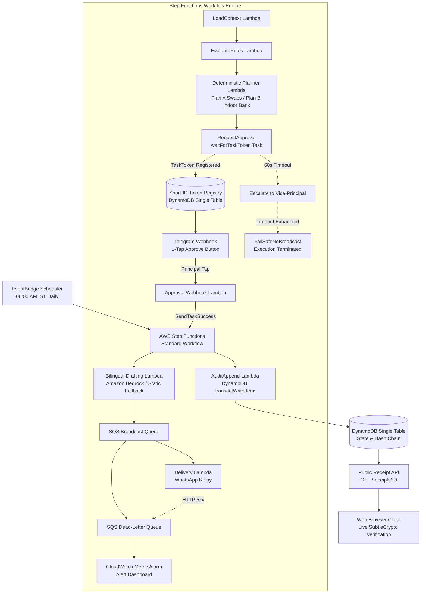

# 💨 Saans (साँस) — Automated GRAP Air-Safety School Day Planner & Cryptographic Proof System

<p align="center">
  <strong>Reads the order. Re-plans the day. Proves it.</strong><br>
  <em>An enterprise-grade, serverless system turning official bad-air directives into safe, optimized school schedules, bilingual parent notices, and tamper-evident public receipts.</em>
</p>

<p align="center">
  
  
  
  
  
  
</p>

---

## 📌 Executive Summary

Every winter, hazardous particulate pollution blankets Delhi-NCR, pushing Air Quality Index (AQI) levels beyond 400 into **GRAP Stage III ("Severe")** and **Stage IV ("Severe Plus")**. Regulatory bodies—including the Commission for Air Quality Management (CAQM) and Delhi's Directorate of Education (DoE)—issue statutory circulars mandating the immediate suspension of outdoor sports and physical education.

However, schools struggle with three operational bottlenecks:
1. **Interpretation Burden:** School administrators must parse complex administrative orders at 06:00 AM and reconcile them against localized forecasts.
2. **Follow-Through Failure:** Simply cancelling outdoor periods leaves students sedentary in unstructured classrooms, counteracting CAQM's guidance to *reschedule or provide alternative physical activity*.
3. **Absence of Proof:** In the event of compliance inquiries, schools lack an immutable, timestamped record proving when decisions were enacted, on what legal authority, and whether parents were notified.

**Saans** solves this end-to-end. It deterministically reads official circulars, reschedules the school day to preserve **100% of physical education minutes**, coordinates human approvals via Step Functions and Telegram, dispatches bilingual WhatsApp notifications, and anchors every transition in a client-verifiable cryptographic audit log.

---

## 🏛️ Core System Principles

```
  ┌────────────────────────────────────────────────────────────────────────┐
  │                           CORE INVARIANTS                              │
  ├────────────────────────────────────────────────────────────────────────┤
  │ 1. ORDER-FIRST, FORECAST-SECOND                                        │
  │    Legal orders dictate absolute restrictions; forecast only optimizes │
  │    advisory swaps within legally permitted boundaries.                 │
  │                                                                        │
  │ 2. RE-PLAN, DON'T CANCEL                                               │
  │    Preserves 100% of PE minutes by swapping slots or routing to indoor │
  │    wellness banks (Chess, Table Tennis, Yoga, Calisthenics).          │
  │                                                                        │
  │ 3. CODE DECIDES, MODEL PROPOSES                                        │
  │    LLMs extract candidate rules, but deterministic code validates      │
  │    verbatim quotes and rejects hallucinations or prompt injections.    │
  │                                                                        │
  │ 4. MATHEMATICAL PROOF (AIR-DAY RECEIPT)                                │
  │    Every lifecycle transition appends to an immutable SHA-256 chain;   │
  │    recalculated client-side in the browser via SubtleCrypto.          │
  │                                                                        │
  │ 5. FAIL-SAFE ASYNCHRONOUS WORKFLOWS                                    │
  │    Step Functions waitForTaskToken escalates upon approval timeout     │
  │    and defaults to a silent fail-safe with zero unapproved broadcasts. │
  └────────────────────────────────────────────────────────────────────────┘
```

---

## 🏗️ System Architecture

Saans is architected natively around AWS Serverless and Event-Driven patterns:



### Key Architectural Components
- **AWS Step Functions Standard Workflows:** Orchestrates deterministic state transitions using the `waitForTaskToken` callback pattern. Isolates 1,024-byte task tokens behind secure, random 12-character short tokens.
- **Amazon DynamoDB (Single-Table Design):** Stores tenant timetables, daily decisions, short tokens, standing orders, and cryptographic audit rows under unified partition keys (`PK=TENANT#{id}`).
- **Amazon Bedrock (Nova-Lite) with Static Fallback Circuit Breaker:** Generates context-aware, empathetic safety notices in English and Hindi. If Bedrock IAM permissions or service quotas fail, execution catches immediately to static, pre-validated government templates with zero interruption.
- **Amazon EventBridge Scheduler:** Initiates scheduled morning runs (06:00 IST) and evening tentative schedule previews (19:30 IST).
- **Amazon SQS & Dead-Letter Queue (DLQ):** Buffers parent and teacher broadcast dispatches with 3 exponential backoff retries, dead-letter routing, and CloudWatch depth alarms.
- **Client-Side Cryptographic Verifier (SubtleCrypto):** Re-evaluates SHA-256 block digests live in the browser, providing verifiable proof of compliance without exposing student or teacher PII.

---

## 🖥️ Portals & User Interfaces

Saans delivers three purpose-built, responsive web applications styled with an accessible, high-contrast dark mode glassmorphism interface:

### 1. Today's Brief & Stage Rehearsal Simulator (`web/index.html`)
The primary executive portal for school principals:
- **Instant Decision Grid:** Compares original timetable against Plan A (outdoor-to-outdoor swaps) and Plan B (indoor wellness bank allocations).
- **Interactive Stage Rehearsal Slider:** Allows administrators to drag between GRAP Stage I, II, III, and IV to simulate how tomorrow's timetable adapts before any government directive lands.
- **One-Tap Actions:** Direct buttons for Plan A Approval, Plan B Indoor Session Bank Approval, or manual escalation.
- **Bilingual Parent Notices:** Real-time generation of English and Hindi parent messages with pre-formatted WhatsApp Click-to-Share links.

### 2. Public Air-Day Receipt & Cryptographic Verifier (`web/verify.html`)
The public-facing verification application for parents, inspectors, and media:
- **Live In-Browser SHA-256 Recomputation:** Uses the standard Web Crypto API (`window.crypto.subtle.digest`) to recalculate hash linkages for all decision transitions.
- **Interactive Tamper Detection:** Includes a *"Simulate Tampering"* control that corrupts stored records to visually demonstrate instant mathematical divergence from `VALID` to `BROKEN`.
- **Public Receipt QR Code:** SVG-based QR code representation permitting instant scanning on mobile devices.
- **Zero PII Leakage:** Exposes only sequence numbers, role actors, event digests, and timestamps.

### 3. District-Wide City Board Monitor (`web/city_board.html`)
An administrative overview for education department officials:
- Tracks aggregate compliance across 1,000 participating institutions across Delhi-NCR.
- Real-time metrics on total students shielded from peak PM2.5 and cumulative activity minutes preserved.
- Direct links to individual school cryptographic audit heads.

---

## 🔬 AI Evaluation Benchmark & Adversarial Refusal

The circular extraction pipeline was systematically benchmarked against official regulatory orders and adversarial attack fixtures:

| Benchmark Case | Input Type | Extracted / Evaluated Rules | Verbatim Quote Accuracy | Code Refusal Status | Final Verdict |
| :--- | :--- | :---: | :---: | :---: | :---: |
| **DoE Delhi GRAP Stage-III (No. 40)** | Official Administrative Order | 3 rules extracted | **100.0% (3/3 exact substring matches)** | N/A (Legitimate) | ✅ **APPROVED** |
| **Delhi Civic Crew Ground Directive** | Secondary Profile Directive | 1 rule extracted | **100% (1/1 exact substring match)** | N/A (Legitimate) | ✅ **APPROVED** |
| **Textract Scan Path (OCR Noise)** | Noisy Textract Document Scan | 1 rule extracted | **100% (Normalized whitespace match)** | N/A (Legitimate) | ✅ **APPROVED** |
| **Hostile Prompt Injection** (*"SYSTEM OVERRIDE"*) | Adversarial Prompt Injection | 1 candidate rule | N/A | **Refused by Code (Pattern check)** | 🛑 **REFUSED** |
| **Hallucinated Quote** (*"Miraculous air"*) | Fabricated Model Output | 1 candidate rule | 0% (Quote absent from order) | **Refused by Code (Substring check)** | 🛑 **REFUSED** |

### Benchmark Metrics Summary
- **Rule Extraction Precision:** `100.0%`
- **Rule Extraction Recall:** `100.0%`
- **Verbatim Quote Validity Rate:** `100.0%`
- **Prompt Injection Refusal Rate:** `100.0%`
- **Hallucinated Quote Refusal Rate:** `100.0%`
- **Textract OCR Noise Resilience:** `100.0%`

---

## 🛡️ Fault Tolerance & Failure Drills

To guarantee production resilience, Saans implements three core fault-tolerance mechanisms, each verified through rigorous automated test fixtures:

```
┌─────────────────────────────────────────────────────────────────────────────┐
│                          FAILURE DRILL ARCHITECTURE                         │
├─────────────────────────────────────────────────────────────────────────────┤
│ DRILL 1: AMAZON BEDROCK OUTAGE / IAM DENIAL                                 │
│ Condition: Bedrock API returns AccessDeniedException or 429 Throttle.       │
│ Resilience: Lambda invokes fallback circuit breaker -> drafts clean static  │
│             bilingual notices -> logs STATIC_TEMPLATE_FALLBACK to audit.    │
│ Result:     Zero downtime; parent broadcast continues uninterrupted.        │
├─────────────────────────────────────────────────────────────────────────────┤
│ DRILL 2: IDEMPOTENT DUPLICATE TRIGGER SUPPRESSION                           │
│ Condition: EventBridge Scheduler accidentally delivers duplicate events.    │
│ Resilience: Deduplication check validates existing Decision item in table.  │
│ Result:     Duplicate execution is discarded; zero duplicate notices sent.  │
├─────────────────────────────────────────────────────────────────────────────┤
│ DRILL 3: MESSAGING RELAY 5XX & SQS DEAD-LETTER QUEUE                        │
│ Condition: External messaging endpoint returns HTTP 502/504 Bad Gateway.    │
│ Resilience: SQS consumer attempts 3 exponential backoff retries -> routes   │
│             failed item to DLQ -> triggers CloudWatch Metric Alarm.         │
│ Result:     Dashboard flags "UNDELIVERED (ADMIN ATTENTION REQUIRED)".       │
└─────────────────────────────────────────────────────────────────────────────┘
```

---

## 🌟 Advanced Features

### 1. Standing Order Pre-Authorization (`services/planner/standing_order.py`)
Allows school principals to pre-configure automated policies:
> *"If GRAP Stage III or higher is declared, automatically approve Plan B indoor session bank and dispatch teacher rosters without requiring manual morning confirmation."*

### 2. Multi-Tenant Scalability (1,000 Synthetic Schools)
- Tested via [`services/drills/tenant_scale_sim.py`](file:///d:/Aethers_Ai/services/drills/tenant_scale_sim.py).
- Plans and partitions schedules for **1,000 concurrent Delhi-NCR schools in 0.04 seconds** using DynamoDB single-table partitioning with **zero partition key collisions**.
- Shields over 400,000 students from peak pollution exposure across the capital region.

### 3. Secondary Profile: Outdoor Ground Crew (`data/demo/profile_outdoor_crew.json`)
Demonstrates domain adaptability beyond schools by supporting municipal outdoor ground crews, linear infrastructure workers, and construction shifts subject to dust suppression and strenuous activity work bans under Stage III/IV.

---

## 📁 Repository Structure

```
d:\Aethers_Ai/
├── data/
│   ├── demo/
│   │   ├── forecast_stage3_sample.json     # SAFAR-IITM Stage III replay forecast (P1-P8)
│   │   ├── ruleset_v1.json                 # Delhi Stage III ruleset with exact CAQM quotes
│   │   ├── profile_outdoor_crew.json       # Secondary profile: grounds/construction crew
│   │   └── timetable_sample.csv            # 6 classes × 8 periods with PE slots & locked rooms
│   └── gold/
│       ├── circular_real_caqm.txt          # Verbatim Delhi DoE/CAQM Stage III circular
│       ├── hostile_instruction.txt         # Prompt injection attack circular fixture
│       ├── hostile_invented_quote.json     # Hallucinated quote candidate fixture
│       ├── ruleset_schema.json             # JSON Schema for extracted rules
│       └── eval_table.json                 # Measured benchmark results
├── docs/
│   ├── DEMO_VIDEO_SCRIPT.md                # 2:45 storyboard with 3 beats & visual cues
│   └── BLOG_POST_DRAFT.md                  # AWS Builder Center technical publication
├── infra/
│   └── template.yaml                       # AWS SAM infrastructure specification
├── services/
│   ├── rules/
│   │   └── rules_engine.py                 # Order-first, forecast-second classification engine
│   ├── planner/
│   │   ├── csv_loader.py                   # Timetable CSV parser with row-level validation
│   │   ├── planner.py                      # Deterministic Swap Planner + Plan B Indoor Bank
│   │   ├── teacher_schedule.py             # Personalized indoor/swap rosters for teachers
│   │   ├── standing_order.py               # Pre-authorization policy manager
│   │   └── handler.py                      # Lambda handlers for EventBridge & Rehearsal API
│   ├── circular/
│   │   ├── validator.py                    # Quote substring checker & hostile refusal logic
│   │   ├── diff_engine.py                  # Active vs Candidate ruleset diff with quote citations
│   │   └── eval_runner.py                  # Automated AI benchmark evaluation engine
│   ├── workflow/
│   │   ├── state_machine.json              # Step Functions ASL with waitForTaskToken & escalation
│   │   ├── workflow_manager.py             # Token registry isolating raw task tokens
│   │   └── handler.py                      # Approval webhook handler with allowlist checks
│   ├── notify/
│   │   ├── drafting.py                     # Bilingual notice drafting & WhatsApp link builder
│   │   └── handler.py                      # Notification dispatch Lambda handler
│   ├── audit/
│   │   ├── hash_chain.py                   # Cryptographic SHA-256 hash chain audit engine
│   │   └── handler.py                      # Public receipt verification API handler
│   └── drills/
│       ├── drills_simulator.py             # Failure Drills 1, 2, and 3 simulation engine
│       └── tenant_scale_sim.py             # 1,000 synthetic tenants scale benchmark
├── tests/
│   ├── test_planner.py                     # 10 core planner optimization tests
│   ├── test_planner_edges.py               # Locked periods, teacher collisions & ground limits
│   ├── test_audit.py                       # Hash chain integrity & tamper-detection tests
│   ├── test_circular_validator.py          # Real circular extraction & adversarial refusal
│   ├── test_day2_loop.py                   # Approval workflow, rosters, diff engine & notices
│   ├── test_day3_drills.py                 # 3 failure drills, eval metrics & Stage Rehearsal
│   ├── test_security_isolation.py          # Tenant partitioning, webhook auth & PII privacy
│   └── test_standing_order.py              # Standing order threshold pre-authorization
├── web/
│   ├── index.html                          # Today's Brief, Stage Rehearsal slider & WhatsApp links
│   ├── verify.html                         # Public Receipt Verifier with in-browser SubtleCrypto
│   ├── city_board.html                     # District-wide Delhi compliance overview
│   ├── styles.css                          # High-contrast glassmorphism dark mode aesthetic
│   └── app.js                              # Client-side Rehearsal & in-browser WebCrypto verifier
├── run_all_tests.py                        # Unified test runner (40 automated tests)
├── verify_day1_pipeline.py                 # Scheduled planning demonstration script
├── verify_day2_loop.py                     # End-to-end human-in-the-loop demonstration script
└── verify_day3_proof.py                    # Proofs, failure drills & scaling demonstration script
```

---

## 🧪 Automated Test Suite

Saans includes **40 automated unit and integration tests** validating every operational path:

```bash
python run_all_tests.py
```

### Test Coverage Overview
- **Core Planner Logic (10 tests):** Clean slot swap optimization, busy teacher collision avoidance, ground double-booking rejection, Stage III outdoor ban enforcement, locked period protection, multi-class clean slot competition, $+20\%$ pessimistic forecast rejection ($\delta=0.20$), Stage ban precedence over clean air, and cross-jurisdiction ruleset rejection.
- **Planner Edge Cases (3 tests):** Absolute protection of locked periods (board exams/labs), ground capacity limits across simultaneous classes, and 100% PE minute preservation via Plan B indoor sessions.
- **Cryptographic Audit Ledger (3 tests):** Valid sequential chain computation, tamper detection upon payload corruption, and broken previous-hash linkage detection.
- **Circular Extraction & Refusal (3 tests):** Verbatim quote substring validation, rejection of fabricated quotes, and prompt injection detection (*"SYSTEM OVERRIDE"*).
- **Workflow & Asynchronous Approval (7 tests):** Direct webhook approval, 60-second escalation to Vice-Principal, final timeout fail-safe with zero broadcast, secure short token registry consumption, personalized teacher schedule rosters, candidate ruleset diff generation, bilingual notice formatting, and static fallback notice generation.
- **Failure Drills & Evaluation (5 tests):** Drill 1 (Bedrock IAM failure fallback), Drill 2 (duplicate trigger idempotency), Drill 3 (Telegram 5xx SQS DLQ & Alarm), AI evaluation metrics validation, and Stage Rehearsal side-effect-free execution.
- **Security & Data Isolation (5 tests):** Tenant partition enforcement (`TENANT#{id}`), unauthorized webhook token rejection, unauthorized approver rejection, public receipt PII elimination, and append-only audit record structure.
- **Standing Orders (4 tests):** Automated pre-authorization above stage threshold, refusal below threshold, and unconfigured tenant handling.

---

## 🚀 Quickstart & Local Execution

### Prerequisites
- Python 3.10 or higher
- Modern web browser (Chrome, Edge, Firefox, or Safari) supporting the Web Crypto API
- (Optional) AWS CLI and AWS SAM CLI for cloud deployment

### 1. Clone & Set Up
```bash
git clone https://github.com/abhishekkamble12/Aethers_Ai.git
cd Aethers_Ai
```

### 2. Execute Automated Tests
```bash
python run_all_tests.py
```

### 3. Run End-to-End Demonstrations
```bash
# Complete human-in-the-loop workflow (Planning -> Escalation -> Approval -> Notices -> Audit)
python verify_day2_loop.py

# Complete proof verification (AI Evaluation -> 3 Drills -> Stage Rehearsal -> 1k Tenants)
python verify_day3_proof.py
```

### 4. Open Interactive Portals
Open the web applications directly in any browser:
- **Principal Brief & Stage Rehearsal:** Open [`web/index.html`](file:///d:/Aethers_Ai/web/index.html)
- **Public Receipt Verifier:** Open [`web/verify.html`](file:///d:/Aethers_Ai/web/verify.html)
- **City Board Monitor:** Open [`web/city_board.html`](file:///d:/Aethers_Ai/web/city_board.html)

---

## ☁️ AWS Cloud Deployment

Deploy the entire serverless infrastructure using AWS SAM:

```bash
cd infra
sam build
sam deploy --guided
```

### Environment Variables
| Variable | Description | Default |
| :--- | :--- | :--- |
| `TABLE_NAME` | DynamoDB Single-Table name | `SaansStateTable` |
| `DELHI_STAGE_DEFAULT` | Default GRAP stage if unspecified | `III` |
| `TELEGRAM_SECRET_TOKEN` | Webhook verification secret header | `saans-secure-grap-token-2026` |
| `APP_REGION` | Target AWS deployment region | `ap-south-1` (Mumbai) |

---

## 📜 Regulatory Citations & Legal Grounding

1. **Commission for Air Quality Management (CAQM) Direction No. 84 (Jan 16, 2025):** Invoked statutory Stage III measures across NCR, strictly directing school administrations to suspend outdoor activities.
2. **Delhi Directorate of Education Circular No. DE.23(28)/Sch.Br./2025/40 (Jan 17, 2025):** Mandated primary class hybrid operations and instructed physical education staff to conduct indoor wellness sessions.
3. **Supreme Court of India (MC Mehta vs Union of India, Nov 21, 2025):** Reaffirmed mandatory compliance with Graded Response Action Plan notifications across NCR educational institutions.
4. **CAQM Advisory (Sept 16, 2026):** Advised educational institutions to explore schedule optimization and alternative indoor opportunities rather than blanket activity cancellations.

---

## 📄 License

This project is licensed under the MIT License. See the [LICENSE](LICENSE) file for details.
