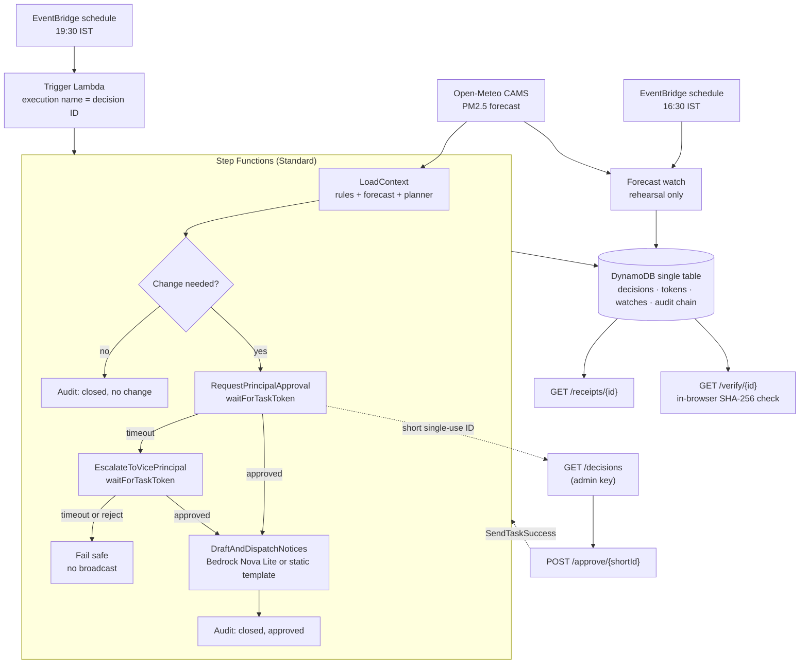

# Saans (साँस): the bad-air school day, re-planned and proven

<p align="center">
  <strong>Reads the order. Re-plans the day. Proves it.</strong><br>
  <em>A serverless AWS system that turns Delhi-NCR GRAP air-pollution orders into a safe, approved school timetable,
  bilingual notices, and a public receipt anyone can verify in their browser.</em>
</p>

<p align="center">
  
  
  
  
  
  
</p>

---

## The problem

Every winter Delhi-NCR's air crosses into GRAP Stage III and IV. The Commission for Air Quality Management (CAQM) and
Delhi's Directorate of Education (DoE) then issue orders that halt outdoor sports and physical education (PE).

A principal gets that order late in the evening or early in the morning. They then have to:

1. **Work out what applies.** Which classes, which periods, from when, and what the forecast allows on top.
2. **Re-plan, not just cancel.** Cancelling PE leaves children sitting idle. The authorities ask schools to reschedule or
   provide alternatives.
3. **Tell everyone.** Teachers need the new plan. Parents need a notice in Hindi and English.
4. **Prove it later.** When an inspector or a parent asks what the school did and why, there is usually no record.

Saans does all four, keeps a person in charge of every decision, and leaves a tamper-evident trail.

## What happens on a bad-air day

```
19:30 IST  Scheduled run starts for tomorrow (one run per school, date and session; duplicates refused)
   │
   ├─ Load the declared GRAP stage, the validated ruleset, the timetable and the PM2.5 forecast
   ├─ Plan: move outdoor periods to cleaner permitted slots, or replace them with indoor active sessions
   │        in the cleanest free room; classes with sensitive students get stricter limits and choose first
   ├─ Ask the principal to approve  ──60 s, no answer──▶  ask the vice-principal  ──no answer──▶  fail safe
   │                                                                                           (nothing sent)
   ├─ Approved: draft teacher and parent notices (English + Hindi) with a WhatsApp share link
   └─ Every step is appended to a SHA-256 hash chain; the public receipt re-verifies it in the browser
```

Separately, a **forecast watch** runs at 16:30 IST. It rehearses the plan for the next two school days and stores a
labelled contingency draft. It never declares a stage, never notifies anyone, and never creates a decision.

## Measured on the demo school

The demo school has 6 classes, 48 periods a day and 6 outdoor PE periods. These are the planner's own outputs on the
Stage III replay scenario. Exposure figures are modelled, not measured.

| Declared stage | Periods moved to a cleaner slot | Periods replaced indoors | PE minutes kept active | PE minutes lost | Modelled outdoor exposure cut |
| :--- | :---: | :---: | :---: | :---: | :---: |
| I or II | 1 | 5 | 240 of 240 | 0 | 95% |
| III or IV | 0 | 6 | 240 of 240 | 0 | 100% |

At every stage, three classes have students with respiratory conditions, so they get stricter forecast limits. The
indoor rooms chosen have a modelled 67–70% lower PM2.5 than outdoors, estimated from each room's ventilation type.

**Why Stage I–II matters most.** At Stage III and IV the order bans outdoor activity, so everything goes indoors. At
Stage I and II the order permits outdoor PE and the forecast decides. That is where Saans finds a cleaner slot that
no one would compute by hand, and explains why in a per-period `decision_trace`.

## Live on AWS

The backend is deployed as the CloudFormation stack `saans` in `us-east-1`.

```
https://367bcz1ry5.execute-api.us-east-1.amazonaws.com/Prod
```

| Endpoint | Method | Access | What it does |
| :--- | :--- | :--- | :--- |
| `/health` | GET | Public | Table, ruleset hash, declared stage, forecast freshness, Bedrock availability and audit-chain head |
| `/forecast?hours=48` | GET | Public | Hourly PM2.5 with advisory and restricted thresholds and the first crossing. Cached for 1 hour |
| `/forecast?source=replay` | GET | Public | The labelled, hand-built Stage III scenario, for demos without network access |
| `/rehearse` | POST | Public | Re-plans tomorrow at any stage with no side effects. Powers the stage slider |
| `/decisions` | GET | Admin key | The principal's brief, with pending approval links |
| `/approve/{shortId}` | POST | Single-use link | The approver's answer. Resumes the paused workflow |
| `/watch` | GET | Admin key | Contingency drafts for the next two school days, and how to start a run for them |
| `/receipts/{id}` | GET | Public | The decision's audit rows and the server's verdict on the chain |
| `/verify/{id}` | GET | Public | A self-contained page that recomputes every hash in your browser |

Admin endpoints need the `x-saans-admin-key` header. Responses carry counts only, never child-level data.

To smoke-test the deployment:

```bash
# reads the admin key from SAANS_ADMIN_KEY, or from the git-ignored infra/deploy.secrets
python scripts/test_live_api.py
```

## Architecture



All 14 Lambda functions share one bundle built by `scripts/build_lambda.py`. The infrastructure is one SAM template,
[infra/template.yaml](infra/template.yaml).

## Design principles, and where the code enforces them

| Principle | How it is enforced |
| :--- | :--- |
| **Order first, forecast second.** A clean forecast can never relax a stage ban. | `services/rules/rules_engine.py` classifies each period from the order before the forecast is considered. |
| **Re-plan, don't cancel.** | The planner tries a permitted cleaner slot first, then an indoor active session. It reports minutes moved, replaced and lost, computed from the timetable. |
| **Plan for forecast error.** | A swap must pass both the nominal forecast and a pessimistic one that is 20% higher. |
| **No clashes.** | Swaps are rejected if they double-book a teacher or a venue, or touch a locked period such as an exam. |
| **Sensitive children first.** | Classes with students who have respiratory conditions get scaled-down limits and pick slots and rooms first. Only counts are stored. |
| **A person decides.** | Nothing is sent without an approval. Step Functions holds the wait, escalates on timeout, and fails safe with no broadcast. |
| **Links can't be forged or replayed.** | Task tokens never leave the server. Approvers get a short ID bound to one decision and one role. It expires and is consumed with a conditional write. |
| **Runs happen once.** | The Step Functions execution name is the decision ID, so a second trigger for the same school, date and session is refused. |
| **Every claim is checkable.** | Each audit row hashes the previous row's hash plus its own canonical JSON. Appends are conditional on the chain head. The verify page recomputes the chain in the browser with Web Crypto. |
| **Fallbacks are labelled.** | If the live forecast fails, the replay scenario is used and marked `is_replay`. If Bedrock fails, the static template is used and the audit chain records it per notice. |

## Rules come from the order, checked by code

Rules are versioned data in [data/demo/ruleset_v1.json](data/demo/ruleset_v1.json). Each rule must carry a quote that
is a verbatim substring of the source circular. The validator in `services/circular/validator.py` refuses a rule whose
quote is absent from the document, and refuses known prompt-injection text.

What this measures today, from [data/gold/eval_table.json](data/gold/eval_table.json):

| Check | Result |
| :--- | :--- |
| Real circulars in the gold set | 1 (DoE Delhi Stage III circular No. 40) |
| Hand-entered rules accepted with verbatim quotes | 3 of 3 |
| Injected "SYSTEM OVERRIDE" instruction | Refused |
| Invented quote | Refused |
| Accepted rules whose action is not supported by their quote | 2 of 3, listed as known gaps |

Rules are entered by hand from the circular today. Model-based extraction with Amazon Bedrock is the next step. It is
blocked because the AWS account is on the Free plan, where the Nova on-demand quota is zero.

## Notices

Approved plans produce teacher and parent notices in English and Hindi. Every fact in a notice is read from the
approved plan. Indoor air figures are labelled as modelled. The teacher notice states how many classes had stricter
limits. Notices are returned as WhatsApp click-to-share links. Nothing is pushed to phones automatically.

Bedrock Nova Lite drafts the notices when it is available. Until then the static bilingual templates are used, and
each audit row records which one wrote the text.

## Privacy and security

- **No child-level data.** Timetables are class-level. Teachers appear as codes. Sensitive students are stored as a
  count per class, and those counts never enter public responses or the public audit chain.
- **Roles, not names, in the audit chain.** The chain records `principal` or `vice_principal`, never a person.
- **The approver comes from the link, not the request.** Authority is read from the stored short-ID record.
- **Admin endpoints need a key.** It is passed at deploy time and never committed. Scripts read it from the
  environment or the git-ignored `infra/deploy.secrets`.

A data-protection review under India's DPDP Act has not been done. It is required before any real pilot.

## Run it locally

Requires Python 3.10 or later.

```bash
git clone https://github.com/abhishekkamble12/Aethers_Ai.git
cd Aethers_Ai
python -m venv .venv
.venv/Scripts/activate            # Windows. On macOS or Linux: source .venv/bin/activate
pip install -r requirements.txt -r requirements-dev.txt

python run_all_tests.py           # full suite; AWS is mocked with moto
```

The tests cover planner edge cases, the approval workflow paths through the real state machine definition, the
hash chain under concurrent writers, the receipt verifier running the browser code under Node, forecast fallback and
caching, the forecast watch, notice wording, and the Lambda bundle importing every handler.

### Front end

The Next.js dashboard in `app/` is a design prototype. It currently runs on local mock routes in `app/api/` and is
not yet wired to the deployed API. The receipt page served by `GET /verify/{id}` is the real, working verifier.

```bash
npm install
npm run dev
```

## Deploy to AWS

You need the AWS CLI with a named profile. The admin key is a secret you choose, at least 16 characters.

```bash
python scripts/build_lambda.py                         # bundles services/ and data/ into infra/.lambda_src

aws cloudformation package --template-file infra/template.yaml \
    --s3-bucket <your-artifact-bucket> --output-template-file infra/packaged.yaml

aws cloudformation deploy --template-file infra/packaged.yaml --stack-name saans \
    --region us-east-1 --capabilities CAPABILITY_IAM CAPABILITY_AUTO_EXPAND \
    --parameter-overrides AdminApiKey=<your-secret>

python scripts/seed_demo.py                            # reset the demo school and print the next commands
```

With the SAM CLI installed, `sam build` and `sam deploy` from `infra/` do the same using
[infra/samconfig.toml](infra/samconfig.toml).

Start a run by invoking the Trigger Lambda. Its name is the `TriggerFunctionName` stack output.

```bash
aws lambda invoke --function-name <TriggerFunctionName> --cli-binary-format raw-in-base64-out \
    --payload '{"tenant_id": "TENANT#demo", "date": "2026-10-13", "forecast_source": "replay"}' out.json
```

## Repository map

```
services/
  rules/       order-first period classification
  planner/     deterministic planner, rehearsal API, run input validation
  forecast/    Open-Meteo ingest with labelled replay, GET /forecast, forecast watch, GET /watch
  workflow/    Step Functions definition, trigger, approval request, POST /approve, GET /decisions
  notify/      bilingual notice drafting, Bedrock with static fallback
  audit/       hash chain, DynamoDB append, receipts, the /verify page
  circular/    quote validator, ruleset diff, evaluation
  health/      GET /health
  admin/       demo reset and seed
  common/      HTTP helpers and admin-key check
data/demo/     timetable, ruleset, venues, indoor-air factors, class profiles, replay scenario
data/gold/     the real DoE circular, hostile fixtures, evaluation results
infra/         SAM template and deploy settings
scripts/       Lambda bundle build, demo seed, live API smoke test
tests/         unit and integration tests (moto for AWS)
app/           Next.js dashboard prototype
```

## Known limitations

- **The forecast is modelled.** It is CAMS data via Open-Meteo for one grid point, not a ground station reading.
- **Rules are hand-entered** from one real circular. Bedrock extraction is built into the plan but blocked by the
  account's quota.
- **Notices are drafted, not delivered.** Delivery is a manual WhatsApp share. There is no WhatsApp Business or SMS
  registration.
- **Approvals happen through the brief page link.** There is no Telegram bot.
- **The dashboard is a prototype** on mock data.
- **No pilot has run** with a real school, and no school or student counts are claimed.
- **Tamper-evident, not tamper-proof.** The chain shows any edit, but we operate the database.

## Roadmap

1. Bedrock rule extraction with a quote-support check, scored against hand-labelled circulars.
2. Wire the dashboard to `/rehearse`, `/decisions` and `/forecast`.
3. A pilot with one Delhi school for one winter, after a DPDP review.
4. Other rulesets as data: other NCR states, and heat-action-plan circulars.

## Sources

- Directorate of Education, Delhi.
  [Circular No. DE.23(28)/Sch.Br./2025/40, 17 January 2025](https://edudel.nic.in/upload/upload_2025_26/40_dt_17012025sch.pdf),
  implementing CAQM Direction No. 84 (Stage III). The text used for validation is in
  [data/gold/circular_real_caqm.txt](data/gold/circular_real_caqm.txt).
- [CAQM enforces GRAP Stage IV measures, 14 December 2025](https://newsonair.gov.in/caqm-enforces-grap-iv-measures-as-delhi-ncr-air-quality-worsens/).
- Forecast data: [Open-Meteo Air Quality API](https://open-meteo.com/en/docs/air-quality-api), CAMS model.

## License

MIT. See [LICENSE](LICENSE).
